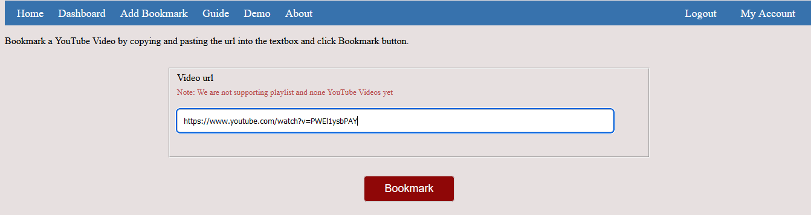
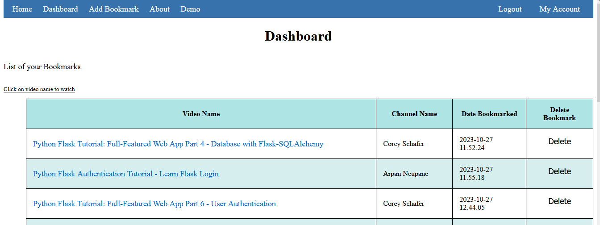

# 
 YouTube Book Marker 

## Overview

YouTube Book is a website that helps users bookmark youtube videos so they can
be able to watch them later without having to log into YouTube.
This solution is intended to users who wants to save some YouTube Videos to
watch later but do not want YouTube profiling their interests.
### Qucik Demo
Video for a quick demo
## How To
- Create an account.
- Navigate to Add Bookmark.
- Copy the YouTube video URL link and paste in the text section and click Bookmark in the

- ### To see the bookmarks
    - Navigate to Dashboard to find the list of your bookmarks.
    - This will show you a table format of your bookmarks.
    - Click on the video name under the video name column.
    - This will redirect you to openning the video in another tab for
    you to watch.
- Click on the delete to delete the bookmark in the Dashboard section.
- Home shows you your last 5 bookmarks which you can watch by clicking on the video name.
About section shows how to navigate the website, but you can also
click Demo to watch a video on how to navigate the YouTube BookMarker.

#### Dashboard:

### **Some things to note**
- This app is not yet supporting none YouTube videos.
- It is not yet supporting YouTube Playlists, which will be implemented soon.
- You cannot bookmark a video more than once

### Security
Users passwords are hashed to improve security.

### Tools
This project have been implemented by using:

**Backend**:
- Python
- Flask
- MySQL

**Frontend**:
- JavaScript
- HTML5
- CSS3

## Author
Robley Ochieng